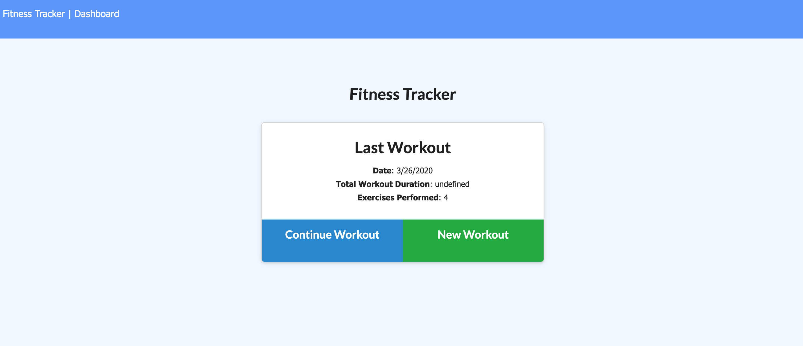
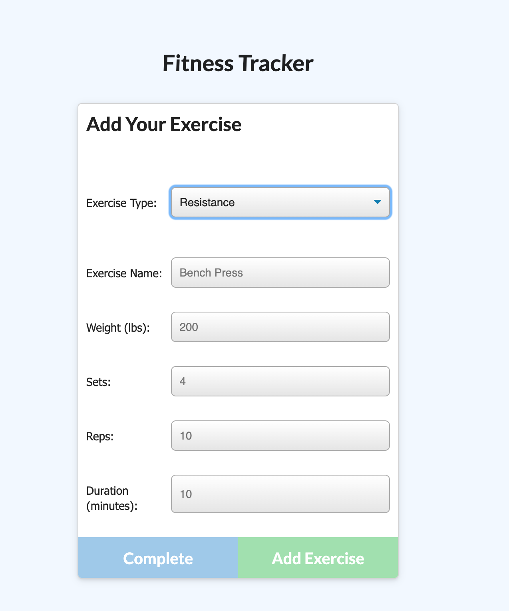
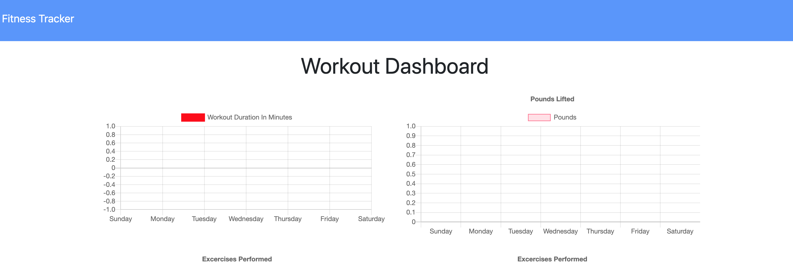

NoSQL: Workout Tracker
For this web app I created Mongo database with a Mongoose schema and handled routes with Express.js.

Getting Started
These instructions will get you a copy of the project up and running on your local machine for development and testing purposes: Copy the repository from Github, create a clone, and open in your code editor of choice. See deployment for notes on how to deploy the project on a live system. Run npm i to install required packages. Run npm start to launch application locally.

Deployment
Connect Github repository to Heroku app

Deploy through Heroku.

Heroku Add Ons: Install mLab MongoDB Sandbox

User Story:
As a user, I want to be able to view create and track daily workouts. I want to be able to log multiple exercises in a workout on a given day. I should also be able to track the name, type, weight, sets, reps, and duration of exercise. If the exercise is a cardio exercise, I should be able to track my distance traveled.

Business Context:
A consumer will reach their fitness goals quicker when they track their workout progress.

Functionality:
When the user loads the page, they are given the option to create a new workout, or continue with their last workout.

The user can:

Add exercises to a previous workout plan.

Add new exercises to a new workout plan.

View multiple the combined weight of multiple exercises on the stats page.

Author

Joseph Register https://github.com/jreg1258/ - https://jreg1258.github.io/ResponsivePortfolio/